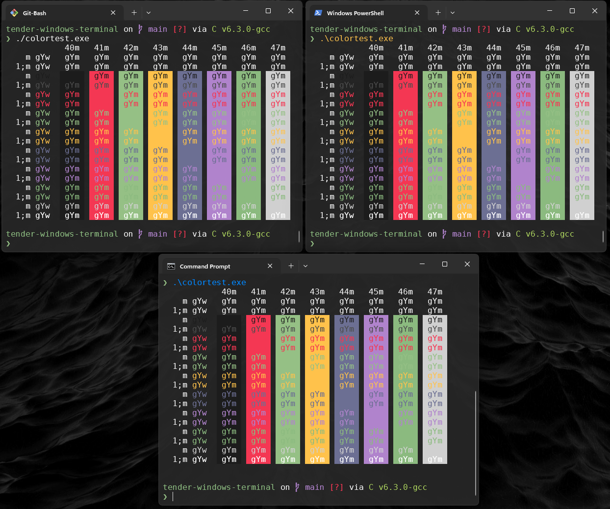

# Tender-Windows-Terminal

A <a href='https://github.com/microsoft/terminal'>Windows Terminal</a> color scheme inspired by the <a href='https://github.com/jacoborus/tender.vim'>tender_vim</a> color scheme.

## Installation

Append to the current color themes defined in `C:\Users\<user>\AppData\Local\Packages\Microsoft.WindowsTerminal\LocalState\settings.json` configuration file with the content from the entry in the [tender.json](./tender.json) file.

## Screenshot

*Font: DejaVu Sans Mono 10pt*

## ColorTest

You can run the same `colortest.exe` from [https://github.com/CompEng0001/Terminal-Agonistic-ColorTest](https://github.com/CompEng0001/Terminal-Agonistic-ColorTest)

## Contribution

<LeftMouse>lease report issues/bugs, feature requests and suggestions for improvements to the [issue tracker](https://github.com/compeng0001/tender-windows-terminal-theme/issues).